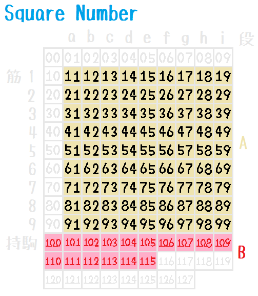
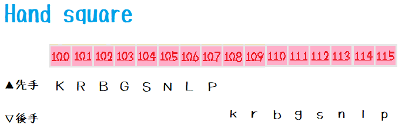
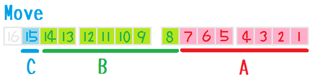

# Design

## Square number

だいたい、以下のような作り（＾～＾）  

  
  

* `A` - Board
* `B` - Hand

## Move

部分的に、以下のような作り（＾～＾）  

  

* `A` - 1～7bit: 移動元(0～127)
* `B` - 8～14bit: 移動先(0～127)
* `C` - 15bit: 成(0～1)
* `move = 0` - 投了

## Non-generation of suicide move

玉が相手の利きに飛び込むのを防ぐ方法です。  
